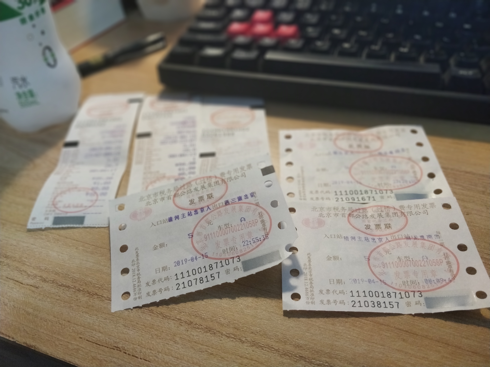

经历了连续9*13小时的工作后，我终于得到了一天的调休计划，昨晚十一点半打车从五棵松到家

洗了个热水澡，关了手机闹铃，打开了Alexa的环境噪音，难的踏实的进入了梦中。

但是！！

我Alexa的闹钟忘记关了，七点被吵醒后一直没有睡着，所以起床热了杯牛奶，弄了张煎饼，涂了点番茄酱就凑合吃了，后来外出和朋友聊了会儿天，倒确实点出了一些目前存在的问题

- 一个好的技术不仅要知其然，更要知其所以然，多挖掘他背后的源码，去思考如何实现，这样才能在高并发时，将200ms优化到100ms，才是一个高级程序员应该具备的素质之一
- Node学习分为三年，第一年知其语法，会写应用，第二年知其框架，高级开发，第三年，读其源码，知其原理
- 多用语言去写一些工具类，多去学习和参考优质轮子，而不是写一些玩具，别人都写烂的东西
- （重要的应该就这么多了）

朋友的话很对，我也进行了思考，自己在JS的道路上，摸着黑走路，对于源码其实要读，但是之前打开看过一眼就一脸懵逼的状态，所以还是需要有时间学习一下优质的GitHub，撕开一个口子，然后进入到正轨，自己去多写一些方法区调用，然后一点点去琢磨，他的实现过程。

4月底的计划就是

- 尽量换一份工作，受不了8117，薪资还不如麦当劳的临时工
- 自如租约到期了，搬家到朱辛庄或者霍营
- 没换工作的话，买一本书通勤看会儿，换工作的话，抽个零碎的时间读，顺便整理笔记，更博（暂定这个月读一下v8的gc）
- 五一出去旅游，暂时想去杭州看看
- 买点竹筒，想做竹筒饭

