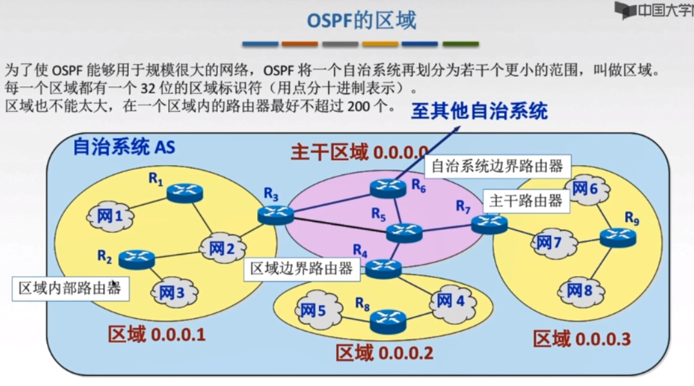

# 基础概念

- 速率（比特率）：在数字信道传送数据位数的速率,b/s,kb/s,Mb/s(mbps:Mb per second)（运营商常用，**进制10进制**），也可以理解为带宽的概念
- 存储容量，1Byte=8bit（进制1024）
- 时延：发送时延+传播时延+排队时延+处理时延
- RTT：往返时延，发送开始到发送方收到接收方的ack，即2*传输时延，不含发送时延，处理时延等
- 信源：产生和发送数据的源头
- 信宿：接收数据的终点
- 信道：信号的传输媒介
- 单工同行：电报，一方只能发送，一方只能接受
- 半双工通信：对讲机，双方错开说话
- 全双工通信：视频电话，双方同时说

# OSI 七层模型，TCPIP四层

## why

解决互联网异构问题

## what

| 序号 | 名称       | TCP/IP     | 常见协议 | 作用 |
| ---- | ---------- | ---------- | -------- | ---- |
| 7    | 应用层     |            |          |      |
| 6    | 表示层     |            |          |      |
| 5    | 会话层     | 应用层     |          |      |
| 4    | 传输层     | 传输层     |          |      |
| 3    | 网络层     | 网际层     |          |      |
| 2    | 数据链路层 | 网络接口层 |          |      |
| 1    | 物理层     |            |          |      |

## difference

| index         | OSI             | TCPIP           |
| ------------- | --------------- | --------------- |
| 1             | 理论模型        | 实际应用        |
| 2-网络层区别  | 无连接+面向连接 | 无连接          |
| 3- 传输层区别 | 面向连接        | 无连接+面向连接 |
|               |                 |                 |

- 面向连接：TCP的建立连接，然后收发数据，断开连接
- 无连接：无需建立连接，直接发数据
- 五层参考模型就是将TCP/IP的网络接口层分成了：数据链路层和物理层，从底向上依次是：物理层，数据链路层，网络层，传输层，应用层

# 传输介质

## what

传输介质是第0层，是物理层下面的载体

## 分类

导向性传输介质：固体，如光纤，双绞线，同轴电缆（电视线）

非导向类传输介质：空气，真空，海水，等

# 物理层

## why

解决计算机的传输媒体多样性的问题

## what

主机发送数据无需关心底层的介质是双绞线还是光纤，或者是华为家生产的，还是中兴家生产的。

类比就是你要发一个包裹，你可以选择四通一达以及顺丰，也不用管包裹走水陆空那一路，你只要负责发包裹，剩下的事情，物理层解决

## 概念

- **码元**：固定时长的信号波形（数字脉冲），举个例子：二进制码元，0和1，四进制码元，00,01,10,11，八进制码元000,001,010,100,011,110,101,111，即，一个码元可以携带多个比特信息
- 码元传输速率：1s传输多少个码元，单位：波特（Baud）
- 信息传输速率：码元传输速率*n（1个码元有n个比特表示，如101，n=3）,值就是带宽b/s
- 编码
- 解码

## 编码

| 名称              | 特点                           |
| ----------------- | ------------------------------ |
| 二进制数据        |                                |
| 非归零编码（NRZ） | 简单，但无法检错，无法保持同步 |
| 归零编码（RZ）    | 一个码元内要恢复到零           |
| 曼彻斯特编码      | 下跳是1，上跳是0               |
| 差分曼彻斯特编码  | 同1异0                         |

其他了解：反向不归零编码（NRZI），4B/5B编码

## 奈氏准则（奈奎斯特定理，传输极限，避免码间串扰）

### definition

在理想环境下，为了避免码间串扰，极限码元传输速率为2W Baud，W为信道带宽，单位Hz

### 极限数据传输率

> $$
> v=2W\log_2 V(b.s)
> $$

- W:带宽（Hz）
- V:几种码元/码元的离散电平数目

### 意义

- 码元传输速率有上限
- 带宽越宽，极限传输率越高
- 使用多元制的调制方法，提高码元携带的比特数

## 香农定理（信噪比）

### definition

> $$
> 信噪比= \frac{信号的平均功率}{噪声的平均功率}
> $$
>
> 记作：S/N
> $$
> 信噪比（dB）=10\ln (S/N)
> $$
> 单位：dB，分贝
>
> ---
>
> 以上是信噪比的两种表现形式

香农定理：解决了带宽受限有噪音的信道中，不产生误差，信息的数据传输率的上限（**奈斯是理想环境**）

### 传输速率

> $$
> v=W\log_2 (1+S/N)  
> $$
>
> 单位：b/s
>
> W：带宽Hz
>
> 题目如果说信噪比是1000，即S/N=1000带入，如果题目说信噪比30dB则带入公式求出S/N的值，再代入公式

### 意义

- 信噪比越大，极限传输速率越高

### 考题注意：题目可能让你求奈氏准则和香农定理的速率，取其最小值为极限速率

## 设备（处理信号）

- 中继器：**再生**和还原**数字**信号
- 集线器：多口的中继器，放大转发，不能分割冲突域，平分带宽

# 数据链路层

## definition

数据链路层将网络层的数据**可靠**的传输到相邻接点的目标及网络层

作用：加强物理层传输原始比特流的功能，将物理层提供的可能出错的连接改为在逻辑上无差错的数据链路

简单来说：数据链路层给报文编号，可以进行流量控制，丢失重发等

## 作用

- 提供：无确认无连接，有确认无连接，有确认面向连接服务
- 链路管理，连接的建立、维持、释放
- 组帧
- 流量控制
- 差错控制

## 组帧

在网络层的数据头尾添加：帧首部，帧尾部，让对方说识别帧的开始和结束

组帧的四种方法：（Transmission）

- 字符计数法：帧首部第一字节记录帧的长度（传输过程中，这个字符可能被修改，或者丢失，后续帧全部错误）
- **字符填充法**：帧首部填充SOH（00000001）,尾部填充EOT（00000100）（数据部分有可能有SOH,EOT--->解决方式，转义字符）
- 零比特填充法：比如首部01111110，则数据部分遇到五个1填充一个0，来避免假SOH
- **违规编码法**：如曼彻斯特会有，高-低-->1，低-高-->0,然后用低低和高高来做SOH,EOT

## 最大传输单元MTU

### why

因为一个帧中IP数据包的内容不可能无限大

### what

MTU最大传送单元

## 差错控制

差错分为两种：

- 位错：比特位数字出错

  修正位错：

  - 检错编码：奇偶校验，CRC循环冗余码（只知道错了）
  - **纠错**编码：海明码（知道错了，还知道错哪儿了）

- 帧错：丢失，重复，失序

  修复帧错：

  - 重传

冗余编码：数据放松之前，附加冗余位，使之符合某种规则，接收端检查不符合规则就判断为出错（即，奇偶校验，CRC，海明码）

### 奇偶校验码（n-1位信息元，1位校验元）

- 奇校验码：1的个数为奇数
- 偶校验码：1的个数为偶数

例：1100101奇校验-->**1**1100101

> "1"可以填到任意位置，只要有奇数个“1”，接收方就认为这一段没有出错，但如果丢了两个“1”就检查不错来了，所以出现了CRC

### CRC循环冗余

要传的数据/多项式=商……余数

发送的数据=要传的数据+余数（FCS帧检验序列，又称冗余码）

例题：1101011011 生成多项式10011

要传的数据末尾加上4个0，除以10011余数1110，则发送的数据为：1101011011   1110

检查：11010110111110%10011==0则帧没有出错，否则丢弃

FCS的生成及校验是硬件实现，处理迅速，不会延迟

### 海明码

1.发现双比特错，纠正但比特错

2.工作原理：牵一发而动全身

3.确定校验码位数r-->确定校验码和数据的位置-->求出校验码的值-->检错并纠错

#### 1.去顶校验码位数r

海明不等式：2^r≥k+r+1(r为冗余信息位，k为信息位)

例如：要发送的数据D=101101

数据位数k=6,满足不等式的最小r为4，也就是海明码有6+4=10位，即数据位6位，校验4位

#### 2.确定校验码和数据的位置

校验码放在2的几次方的位置，剩下填数据位就可以了

#### 3.求校验码的值

第一位校验码校验二进制最后一位为1的数

第二位校验码校验二进制倒数第二位为1的数字

以此类推

令校验位与选中的数异或为0，就可以得到校验位的值

得到101101的海明码是：**00**1**0**011**1**01（第1,2,4,8为为校验位）

#### 4.检错并纠正

取校验位做异或运算，得到的值就是出错的位置（上述例子中假设第五位出错，则四个校验码的值，拼起来的和就是5

## 流量控制和可靠传输机制

### what

解决发送和接受能力不匹配的问题

### difference

|          | 数据链路层           | 传输层             |
| -------- | -------------------- | ------------------ |
| 流量控制 | 点到点（相邻节点）   | 端到端             |
| 手段     | 收不下，不返回确认帧 | 接收端发送窗口公告 |
|          |                      |                    |

### 流量控制方法

- 停止-等待协议
- 滑动窗口协议：
  - 回退N帧协议（GBN：go back N）
  - 选择重传协议SR

#### 停止-等待协议（等确认帧再发送）

没发送完一个帧就停止发送，等待对方的确认，在收到确认后在发送下一个帧

丢帧重传时间(数据丢之或者ack丢失)：>RTT

- 数据丢失重传

- ack丢失，数据重传，接收方丢弃，重传ACK
- ack迟到，数据重传，接收方丢弃，重传ACK，收到第二次发的确认帧，后续收到迟到的ack丢掉

流水线技术：一次发送多帧（滑动窗口的起源）

#### 滑动窗口协议（窗口多帧发送）

采用**累积确认**

|          | 停止等待 | GBN  | SR   |
| -------- | -------- | ---- | ---- |
| 发送窗口 | 1        | >1   | >1   |
| 接受窗口 | 1        | 1    | >1   |

GBN特点

- 上层调用（发送或缓存网络层数据）
- 累计确认（ack为最后收到的帧的编号）
- 超时重传
- （缺点，选择重传修正这个问题）接收方无缓存，延迟或者出错全部丢弃（**如果1号收到2号丢失，3,4号陆续到了都丢弃，等待发送发超时重传2号帧**）

GBN滑动**窗口的长度**：
$$
1≤W≤2^n-1
$$
因为发送窗口过大，会使得对方区别新帧和旧帧，即编号的数目可能是固定的，他是循环利用的，可能会重复

**选择重传协议**（SR=GBK+接收方有窗口）：缓存收到的帧，返回确认收到帧的编号（不代表编号前的帧都收到），窗口长度：
$$
1≤W≤2^n-1
$$
发送方窗口=接收方窗口（大了溢出，小了没意义）

### 信道利用率

发送周期内，有效发送数据所占据的比例，也就是（发送数据帧时间）除以（发送数据帧开始到接收到ack的总时间）
$$
信道利用率=（L/C）/T
$$
L:T内发送L比特数据

C：发送方数据传输率

T:发送周期，发送到收到ack

### 信道吞吐率

信道利用率* 发送方的发送速率

> 数据传输速率4kb/s，单向传播时延30ms，如果停止等待协议的信道最大利用率达到80%，数据帧长度为？

> $$
> 0.8=\frac{L/4}{L/4+2*30}
> $$

### 信道划分介质访问(高效率利用传输介质)

分两种

- 点对点链路：专有线路，如ppp协议
- 广播式链路：共享通信介质，如对讲机

介质访问控制

- 静态分配（不冲突）
  - 频分复用FDM(Frequency Division Multiplexing)
  - 时分复用TDM(time)
  - 波分复用WDM（wave）
  - 码分复用CDM（code）
- 动态分配
  - 轮训访问：
    - 令牌（不冲突）
  - 随机访问：（冲突）
    - aloha
    - CSMA
    - **CSMA/CD**
    - **CSMA/CA**

> 1.统计时分复用STDM
>
> 提出原因：有的主机在这个时间片不会发送信息，信道造成浪费
>
> 通过集中器，ABCD四个人，集中器大小设定为3，每来3个人，就发送走一波数据
>
> 解决TDM平分带宽的问题，集中器的TDM帧可以发送的数据都是一个人的数据，从而不影响带宽
>
> 2.CDMA码分多址，是CDM的一种方式

#### CDM（后续补充，没听懂）

1个比特分为多个chip（芯片/码片），每个站点被指定一个唯一的m位的chip序列

如何划分信道？

> 多个站点同时发送数据时候，要求各个站点芯片序列**相互正交**
>
> 多个站点接收数据的时候，数据在信道中被线性相加

#### ALOHA协议（想发就发）

特点：不监听信道，不按时间片发送，随机重发（发的时候彼此不知道冲突，所以可能两个人都发送失败）

ALOHA改进：时隙ALOHA协议，将**时间分片**，用户在时间片开始时刻同步接入网络信道，如果冲突，则下个**时间片开始**时刻再发送

#### CSMA协议家族（先听再发）

> CSMA:carrier sense multiple access
>
> CS:载波侦听：发送前检测
>
> MA：多点接入

##### 信道忙

- 1-坚持CSMA：**一直监听**到信道闲，冲突则等待随机时间再来一直监听
  - 信道利用率高
  - 两个站点都坚持，死锁
- 非坚持CSMA：等待随机时间后再监听
  - 减少冲突可能性
  - 信道利用率低
- p-坚持CSMA：空闲以p概率传输，忙则以概率1-p等待下个时间片（不必深究），忙则等待随机时间再监听
  - 减少冲突
  - 信道利用率较高
  - 发生冲突后可能会坚持把数据帧发完（提出CD协议）

##### CDMA/CD（先听再说：边听边说）

> cd:collision detection碰撞检测

在CSMA基础上，发送数据时也监听信道，忙则停止发送--半双工网络

争用期/冲突窗口/碰撞窗口：2T，如果没有碰撞则这次发送不会有冲突

如何确定重传？截断二进制指数规避算法（待完善）

最小帧长（避免还没碰撞检测完，数据已经发送结束了）：帧长>=2T*数据发送速率

> 以太网规定最短帧长64B，凡是小的都是无效帧，丢弃

##### CDMA/CA（先听再说，礼让说）

> CA：collision acoidance避免碰撞
>
> 应用于无线局域网的冲突

先检测信道是否空闲-->

空闲时发送RTS（request to send：发送端地址，接收端地址，发送持续时间），忙则等待-->

接收端收到RTS，响应CTS（clear to send），再次期间**不会再响应别人的RTS**-->

发送方收到CTS后，开始发送数据帧（同时预约信道：发送方告知预计传输时间,从而告知别的站点多久后重发）-->

接收端收到数据帧，采用CRC来检验数据，正确则响应ACK，如果丢失遵循上面的规避算法来确定推迟重发时间

|              | CSMA/CD  | CSMA/CA                            |
| ------------ | -------- | ---------------------------------- |
| 传输介质     | 有线     | 无线                               |
| 载波检测方式 | 电压     | 能量检测，载波检测，能量波混合检测 |
| 冲突类型     | 检测冲突 | 避免冲突                           |

相同点：先听再说，监听，冲突后，有限次重传机制

#### 轮询访问介质访问控制

轮询协议：主节点**轮流**和从属节点发送数据

- 轮询开销大
- 等待延迟
- 主节点故障

令牌传递协议：

- 令牌：一个特殊格式的MAC控制帧，不含任何信息
- 每个节点可以拿到令牌**一段时间**，发送数据
- 令牌开销大
- 等待延迟
- 单点故障
- 应用于环网
- 适用于**负载重，通信量**大的网络中

## 局域网（Local Area Network）

- 范围小
- 速度较快
- 延迟短，误码率低，可靠性高
- 共享
- 分布式控制，广播式通信，能广播和组播

星型拓扑，总线型拓扑（CSMA/CD，令牌总线产生逻辑环），环形拓扑（令牌环），属性拓扑

局域网分类：以太网，令牌环网，FDDI网,ATM网，无线局域网

数据链路层=逻辑链路层LLC+截止访问控制MAC层

- LLC识别网络层协议并封装，知道如何处理ACK，为网络层提供：无确认无连接，面向连接，带确认连接，高速传送
- MAC，帧的封装，拆封，帧的寻址识别，发送接收，链路管理，帧差错控制，屏蔽物理链路种类的差异性

## 以太网（Ethernet）

- 便宜
- 使用广泛
- 相对简单
- 速率较高

提供无连接，**不可靠**的服务：

- 无连接：无需握手
- 不可靠，没有编号，不确认，差错丢弃（传输层负责）

通过通信适配器通信：MAC地址，前24位代表厂家，后24位自己规定，常用6个十六进制数字表示

## 无线局域网

## 广域网

PPP协议：点对点协议，只支持全双工

- 简单：无需纠错，无需编号，无需流量控制
- 封装成帧：帧定界符
- 透明传输：异步线路字节填充，同步线路比特填充
- 多种网络层协议：封装IP数据包采用多种协议
- 多种类型链路：串并行，同异步，光电……
- 差错检测：错丢弃
- 检测连接状态
- 最大传送单元：数据部分最大MTU
- 网络层地址协商
- 数据压缩协商

PPP组成的三个部分：

- 一个将IP数据包封装到串行链路（同异步串行）的方法
- 链路控制协议LCP：建立和维护数据链路连接
- 网络控制协议NCP：PPP支持多种网络层协议，对应NCP来配置，为网络层建立和配置逻辑连接

PPP帧格式

HDLC协议

高级数据链路控制：High-level data link control，是一个同步网上传输数据，面向**比特**的数据链路层协议

三种站：

- 主站
- 从站
- 复合站

PPP&HDLC共同点

- 全双工
- 透明传输
- 查错但不纠错

不同点：

| 不同点    | PPP    | HDLC |
| --------- | ------ | ---- |
| 面向      | 字节   | 比特 |
| 协议字段  | 有     | 没有 |
| 序号和ACK | 无     | 有↓  |
| 可靠性    | 不可靠 | 可靠 |

## 链路层设备

- **网桥**：根据MAC的目的地址进行帧的转发和过滤（隔离冲突域）
  - 过滤通信量，增大吞吐量
  - 扩大物理范围
  - 提高可靠性
  - 互联不同物理层
- 交换机

### 网桥

- 透明网桥：以太网上的站点不知道所发送的帧经过了哪几个网桥，是一种热插拔设备--自学习（通过广播来学习转发表）
- 源路由网桥：把详细的最佳路由信息（路由最少\时间最短）放在帧的首部——通过广播方式向目的站发送一个发送帧

### 以太网交换机（多接口网桥）

- 直通式：检查地址直接转发（延迟小，可靠性低，无法支持不同速率的端口交换）
- 存储转发式：将帧放入高速缓存，检查正确性，正确则转发，错误丢弃（延迟大，可靠性高，支持不同速率端口）

|                          | 隔离冲突域 | 隔离广播域 |
| ------------------------ | ---------- | ---------- |
| 物理层（中继器，集线器） | ×          | ×          |
| 链路层（网桥，交换机）   | √          | ×          |
| 网络层（路由）           | √          | √          |

**诀窍**

- 广播域，0个路由1个广播域，1个路由2两个广播域
- 冲突域：链路层设备（交换机）有几根线就是几个冲突域

# 网络层

## 功能

把分组从源端传到目的端，为分组交换网上的不同主机提供通信服务

- 路由选择和分组转发（最佳路径OSPF）
- 异构网互联
- 控制拥塞
  - 开环控制（静）
  - 闭环控制（动态控制）

## 数据交换方式

- 电路交换（两端一根线直连）
- 报文交换
- 分组交换

有两种连接方式

- 数据报方式：无连接服务（无需建立连接，每个分组都有地址）
- 虚电路方式：连接服务（建立连接）

|                        | 数据报服务                       | 虚电路                     |
| ---------------------- | -------------------------------- | -------------------------- |
| 建立连接               | ×                                | √                          |
| 目的地址               | 每个分组都有                     | 建立有，分组只有虚电路号   |
| 路由选择               | 每个分组独立进行路由选择转发     | 同一路径                   |
| 分组顺序               | 不保证有序                       | 有序                       |
| 可靠性                 | 不可靠通信，可靠性由主机保证     | 可靠性由网络保证           |
| 网络故障适应性         | 遇故障丢失，其他分组路径发生变化 | 所有经过此节点都丢包       |
| 差错处理和流量控制主机 | 控制，本身不保证                 | 分组交换网负责或者主机负责 |

## 报文的分装

应用层：报文

传输层：报文段

网络层：IP数据包，分组

数据链路层：帧

物理层：比特流

## IP

## ip数据报格式

ip数据报=首部+数据部分

## ip 数据报分片

### MTU

以太网最大MTU是1500字节

IP数据报第32-63位，标识（16）+标志（3）+片偏移（13）

- 标识（16）：统一数据报的分片使用同一标识
- 标志（4）：中间位DF，DF=1禁止分片，DF=0允许分片，最低位MF,MF=1后面还有分片，MF=0,后面没有分片了
- 片偏移：分片后相对位置，除了最后一个分片，其他都是8B的整倍数

>总长度：单位1B
>
>片偏移：单位是8B
>
>首部长度：单位是4B

## NAT

ip地址转化表，通过端口来实现地址映射

## IP分类

## 子网掩码

## 无分类编址CIDR

## ARP（IP-MAC）

广播ARP请求分组

源ip+目的ip+源MAC+目的MAC(全1)

单播ARP响应分组

ip+mac

如果A-->B经历5个路由，一共要使用6次ARP协议

## DHCP（应用层协议，广播，基于UDP，CS架构）

静态配置ip

动态配置ip-->DHCP协议

- 主机广播DHCP发现
- DHCP服务器广播DHCP提供
- 主机广播DHCP请求
- DHCP服务器广播DHCP确认

## ICMP

ICMP支持主机或者路由器

- 差错报告
- 网络探寻

| ICMP报错           | 含义                     |      |
| ------------------ | ------------------------ | ---- |
| 终点不可达         | 无法交付                 |      |
| 源点抑制（已取消） | 目标向源主机发送，发慢点 |      |
| 时间超过           | TTL=0时，发送超时报文    |      |
| 参数错误           | 首部字段有问题           |      |
| 重定向             | 让主机重新选择路由       |      |

ICMP差错报告报文数据字段

不发送ICMP差错报文的情况

- 对本身的报错出错不再报错
- 第一分片报错，后去分片不报错
- 组播不报错
- 特殊地址不报错（0.0.0.0/127.0.0.1）

ICMP询问报文：

- 回送请求和回答报文（ping）
- 时间戳请求和回答报文（时间同步和测量时间）

ICMP应用

- PING
- Traceroute：跟踪分组发送的路径，使用ICMP时间超过差错报文

## IPv4(32bit)

不能使用的ip地址

| 网络号 | 主机号                      | 作ip源地址 | 作IP目的地址 | 用途                                     |
| ------ | --------------------------- | ---------- | ------------ | ---------------------------------------- |
| 全0    | 全0                         | √          | ×            | 默认路由                                 |
| 全0    | 特定值                      | ×          | √            | 表示本网内某个特定的主机                 |
| 全1    | 全1                         | x          | √            | 广播地址                                 |
| 特定值 | 全0                         | x          | x            | 网络地址，表示一个网络                   |
| 特定值 | 全1                         | x          | √            | 直接广播地址，对特定网络上的所有主机广播 |
| 127    | 除全0,1                     | √          | √            | 用于本地软件换回测试                     |
|        |                             |            |              |                                          |
| 另一种 | 地址范围                    | 网段数     |              |                                          |
| A类    | 10.0.0.0~10.255.255.255     | 1          |              |                                          |
| B      | 172.16.0.0~172.31.255.255   | 16         |              |                                          |
| C      | 192.168.0.0~192.168.255.255 | 256        |              |                                          |

> ABC为专属内部网络地址

## IPv6（128bit）

首部40bit+有效负荷（≥64k）

## 网络层设备

### 路由

- 静态路由算法
- 动态路由算法
  - 全局性：链路状态路由算法OSPF（规模大）
  - 分散性：距离向量路由算法RIP（规模小）

自制系统AS：在单一技术管理下的一组路由器（一个局域网内，自己管理自己的，要不然路由算法无法完成）

路由选择协议

- 内部网关协议IGP（AS内）RIP,OSPF
- 外部网关协议EGP（AS间）BGP

#### RIP

定义：一种分布式基于距离向量的路由选择协议，简单，维护自己到目的网络唯一最佳距离（跳数）记录

feature：

- 仅相邻交换信息
- 每30s更新路由表，180s无消息则判断邻居没了
- 故障发现慢（你发现旁边故障了，但邻居以为经过你就可以到达，然后你以为经过邻居，再经过你就可以到达，循环到，双方都变成16跳，才发现网络故障）

#### OSPF（类似Dijkstra）分布式链路状态

feature：

- 自治系统内广播（非RIP的相邻）
- 交换链路状态（费用，距离，时延，带宽等）
- 链路状态变化才更新
- 每隔30分钟刷新一次数据库中的链路状态
- 故障发现比较快

OSPF分区：

#### BGP

AS间通信，交换网络可达性信息，发生变化时更新

OPEN-->UPDATE-->KEEPALIVE-->NOTIFICATION

| 协议     | RIP        | OSPF     | BGP                              |
| -------- | ---------- | -------- | -------------------------------- |
| 类型     | 内部       | 内部     | 外部                             |
| 路由算法 | 距离-向量  | 链路状态 | 路径-向量                        |
| 传递协议 | udp        | ip       | TCP                              |
| 路径选择 | 跳数最少   | 代价最低 | 较好，非最佳                     |
| 交换节点 | 相邻       | 所有     | 相邻                             |
| 交换内容 | 自身路由表 | 所有     | 首次整个路由表，非首次，变化内容 |

#### IP组播（D类地址）

- 单播
- 广播
- 组播（多播）基于UDP

IGMP协议+组播路由选择协议

# 传输层

- 进程间逻辑通信
- 复用和分用
- 差错检测
- TCP UDP
- 端口号（16bit）
  - 服务端0-1023
  - 服务端1024-49151
  - 客户端49152-65535

| service | port |
| ------- | ---- |
| FTP     | 21   |
| TELNET  | 23   |
| SMTP    | 25   |
| DNS     | 53   |
| TFTP    | 69   |
| HTTP    | 80   |
| SNMP    | 161  |

Socket=ip+port

## UDP

FEATURE:

- 无连接
- 不保证可靠交付
- 面向报文
- 无拥塞控制
- 首部开销小8B，小于20B（TCP）

UDP检验

## TCP

FEATURE

- 面向连接
- 点对点
- 可靠有序
- 全双工
- 面向字节流

序号

确认号：期望收到的序号

数据偏移

URG：紧急位，值为1时高优先级发送

ACK：确认位，连接建立后等于1

PSH:推送位，值为1时，接收方尽快交付给应用进程

RST：复位，必须释放连接

SYN：同步位，1，标明是一个连接请求/连接接受报文

FIN：释放连接

窗口：接受窗口，即允许发送方的数据量

校验和

紧急指针：指出URG=1时，紧急数据的字节数

#### 三次握手

#### 四次挥手

## 流量控制
## 窗口控制
待补充